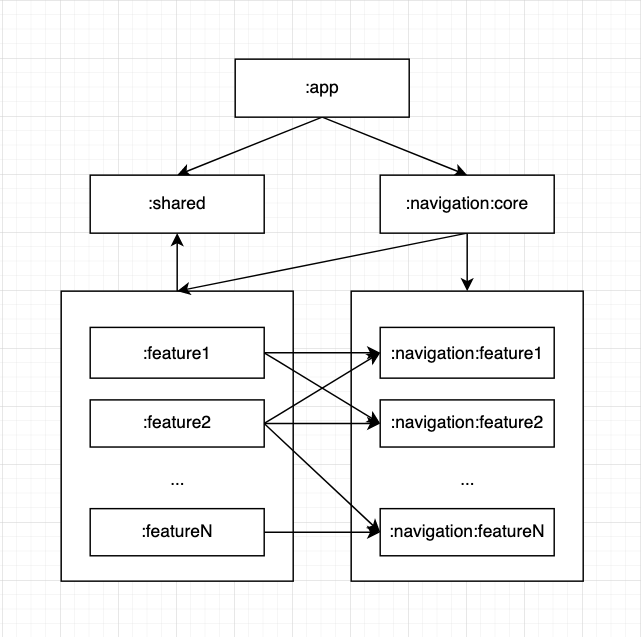

# Android Feature Modules Template

    
    
<i>This is a representation of the architecture, it may vary depending on your use case.</i>

    
<i>The arrows on the top can be read as "talks to".</i>

- Each of the the feature modules on the project have a navigation module which is implemented by itself. Example: **:feature1** implements **:navigation:feature1**, and any other module can consume **:navigation:feature1**.
- Feature modules don't know how the implementation of other modules is done.
- The implementation is provided through **Dependency Inversion**.
- The module responsible for knowing all the feature modules and providing the instances of the navigation of each of these is the **:navigation:core** module.
